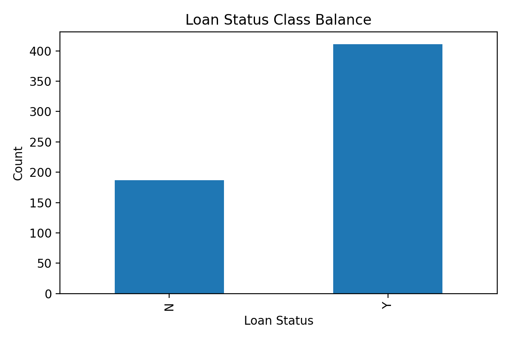
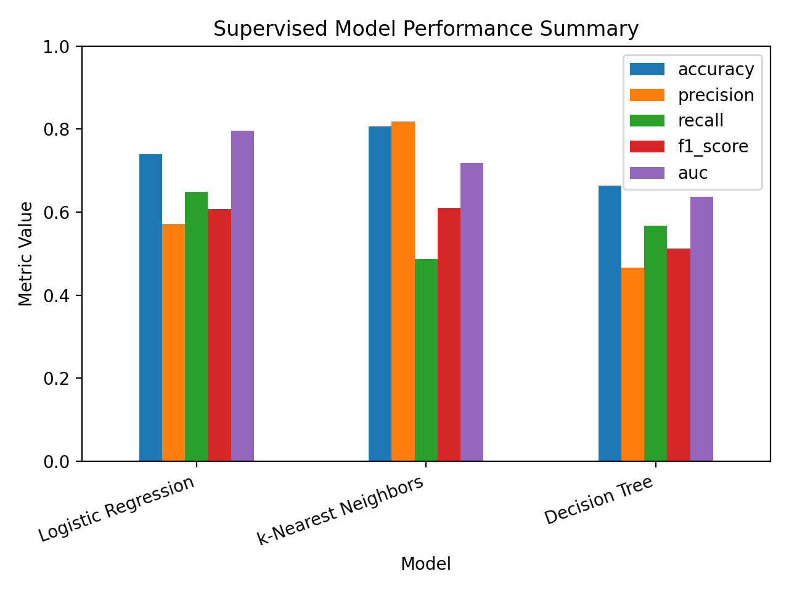

# Loan Approval Prediction: Supervised Learning Models

This repository presents my individual **supervised learning** contribution to a group academic project on loan approval prediction.

The task is a binary classification problem:

> Can we classify loan applications as approved or denied based on applicant attributes?

The target variable is `Loan_Status`, where `Y` means approved and `N` means denied.

## Contribution Note

This was originally a group academic project by **Lening Gao, Selina Salameh, and Xiwei Zhang**.

This repository focuses on my part of the project: the **supervised learning** section. My work focused on fitting, evaluating, and interpreting:

- logistic regression;
- decision tree classification;
- k-nearest neighbors.

The original group report and original R Markdown file are included only as reference materials:

```text
report/group_final_project_reference.pdf
source/original_group_project.Rmd
```

## Project Overview

In financial services, predicting loan approval decisions is important for risk management and lending decisions. This project uses applicant-level information such as income, loan amount, credit history, education, marital status, property area, and loan approval outcome to classify loan applications as approved or denied.

The full group project included preprocessing, visualization, PCA, logistic PCA, unsupervised learning, and supervised learning. This repository highlights the supervised learning component.

## Dataset

The dataset is included in this repository because it is publicly available on Kaggle and was supplied for this academic project.

```text
data/LoanApprovalPrediction.csv
```

The dataset contains 598 observations and 13 variables. The main variables are:

- `Loan_ID`
- `Gender`
- `Married`
- `Dependents`
- `Education`
- `Self_Employed`
- `ApplicantIncome`
- `CoapplicantIncome`
- `LoanAmount`
- `Loan_Amount_Term`
- `Credit_History`
- `Property_Area`
- `Loan_Status`

## Methods

### Logistic Regression

Logistic regression estimates the probability of loan approval or denial using applicant attributes. In the original project, it provided the strongest AUC and recall, making it the preferred default model when catching risky applications is the priority.

### Decision Tree

The decision tree model is interpretable and produces simple decision rules, but it underperformed relative to logistic regression and k-nearest neighbors.

### k-Nearest Neighbors

k-nearest neighbors achieved the highest accuracy and precision. This makes it useful when avoiding false declines is the priority, but it caught fewer risky applications than logistic regression.

## Main Results

| Model | Accuracy | Precision | Recall | F1 Score | AUC |
|---|---:|---:|---:|---:|---:|
| Logistic Regression | 0.7395 | 0.5714 | 0.6486 | 0.6076 | 0.7956 |
| k-Nearest Neighbors | 0.8067 | 0.8182 | 0.4865 | 0.6102 | 0.7189 |
| Decision Tree | 0.6639 | 0.4667 | 0.5676 | 0.5122 | 0.6374 |

The decision tree is easiest to explain but has the weakest predictive performance.

k-nearest neighbors gives the highest accuracy and precision, so it is useful when the business objective is to avoid rejecting good applicants.

Logistic regression gives the best AUC and recall, so it is the better default choice when the business objective is to catch risky applications and reduce loan losses.

## Selected Figures

Class balance in the dataset:



Model-performance comparison:



## Repository Structure

```text
.
├── README.md
├── CITATION_OR_ATTRIBUTION.md
├── data/
│   ├── README.md
│   └── LoanApprovalPrediction.csv
├── notebooks/
│   └── supervised_learning_models.Rmd
├── results/
│   └── model_performance_summary.csv
├── figures/
│   ├── loan_status_class_balance.png
│   └── model_performance_comparison.png
├── report/
│   ├── group_final_project_reference.pdf
│   └── xiwei_supervised_learning_summary.md
└── source/
    └── original_group_project.Rmd
```

## Files

- `data/LoanApprovalPrediction.csv`: original loan approval dataset.
- `notebooks/supervised_learning_models.Rmd`: cleaned supervised learning workflow.
- `results/model_performance_summary.csv`: reported model-comparison metrics.
- `figures/`: selected figures for quick project preview.
- `report/group_final_project_reference.pdf`: original group project report.
- `report/xiwei_supervised_learning_summary.md`: concise summary of my supervised learning contribution.
- `source/original_group_project.Rmd`: original group R Markdown file for reference.

## Software

The project is written in **R**.

Main packages:

- `dplyr`
- `readr`
- `caret`
- `pROC`
- `rpart`
- `class`
- `ggplot2`

Install packages with:

```r
install.packages(c(
  "dplyr", "readr", "caret", "pROC", "rpart", "class", "ggplot2"
))
```

## How to Run

Open the R Markdown notebook:

```text
notebooks/supervised_learning_models.Rmd
```

Then run it from top to bottom in RStudio. The notebook reads the included dataset from:

```text
data/LoanApprovalPrediction.csv
```

## Skills Demonstrated

This project demonstrates:

- supervised classification;
- logistic regression;
- decision tree modeling;
- k-nearest neighbors;
- data preprocessing and missing-value imputation;
- class imbalance handling;
- train/test evaluation;
- confusion-matrix interpretation;
- model evaluation using accuracy, precision, recall, F1 score, and AUC;
- business interpretation for loan approval and credit-risk decisions.

## Limitations

This is an academic machine learning project, not a production credit-risk system. Important limitations include:

- the dataset is relatively small;
- the model is not deployed;
- probability threshold tuning is not fully developed;
- fairness and regulatory validation are not fully developed;
- model monitoring is not included.

## Possible Extensions

Future improvements could include:

- adding probability-threshold tuning;
- adding fairness metrics by demographic group;
- comparing random forest and gradient boosting;
- adding a Shiny dashboard;
- rewriting the workflow in Python using pandas and scikit-learn.
